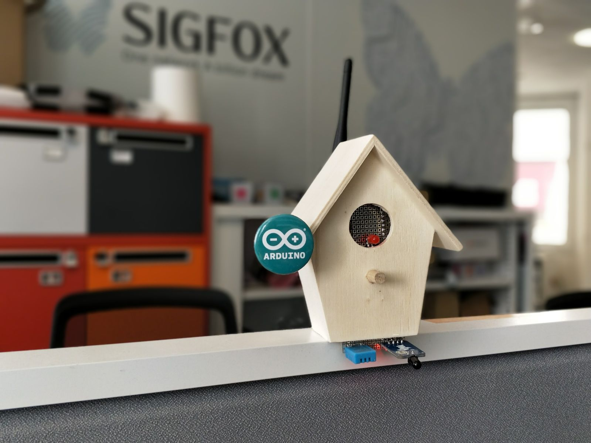
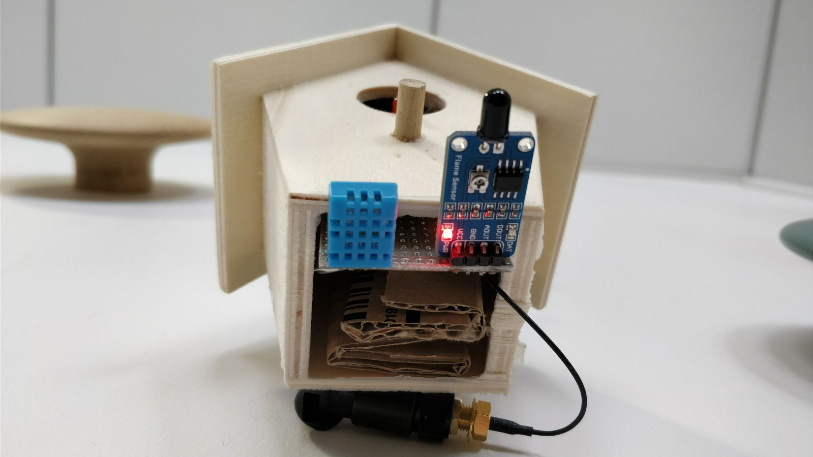
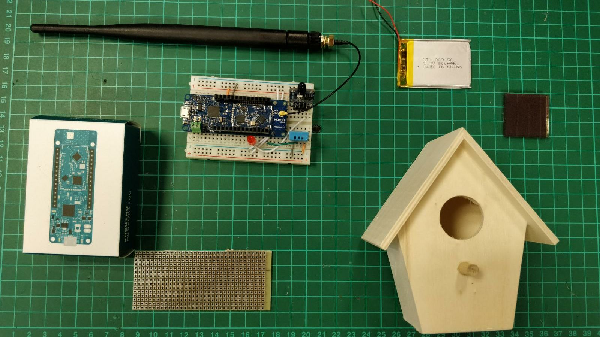

# Sigfox Forest Fire Detector

## Introduction

How to prevent forest from burning? A small Sigfox signal can prevent this natural disaster. In this project, we will use an Arduino MKRFOX1200, a flame detector, a temperature and humidity sensors.

I chose to put all the integrated electronic inside a small bird house, feel free to adapt the support!

Here it is what the first prototype looked like.

If you want to go further, you can add a solar panel with a charging circuit to charge a small battery, this part will may be covered by this tutorial in the near futur. Feel free to submit a pull request on the [Github page](https://github.com/luisomoreau/SigfoxForestFireDetector) if you have some ideas.





## What you need

* One [Arduino MKRFOX1200](https://www.arduino.cc/en/Main.ArduinoBoardMKRFox1200)
* One [flame detector](https://www.amazon.fr/Waveshare-Flame-Sensor-Detection-Raspberry/dp/B00NL5JEPS) or alternatively an IR led between 980nm and 1100 nm.
* A DHT11 temperature and humidity sensor.



## How to detect a fire using infrared sensors

I will try to be as much understandable as I can in this part. However, it is all about physics and I admit, I had some trouble to understand all the principles at the beginning.
I won't bother you the formulas but you can easily find them on Wikipedia.
In our case, a fire forest will mostly be a carbon fire.

Let's start with the Wien's law:


Black body radiation as a function of wavelength for various absolute temperatures. Each curve is seen to peak at a somewhat different wavelength; Wien's law describes the shift of that peak in terms of temperature.

Now look at this graph with the temperature we are interested in.


The wavelengths corresponding to the peak emissions of the Sun (5777 K), the Earth's surface (300 K) and forest fires (600 to 1000 K).

The dashed line represents the 3.9 μm band and you see from Wien's law that 3.9 μm is the wavelength at which a blackbody at 743 K has its peak. This temperature corresponds to the temperature of a fire!

However, it is hard to get a 3.9 μm IR led. So we will use an [IR LED](https://www.amazon.fr/Waveshare-Flame-Sensor-Detection-Raspberry/dp/B00NL5JEPS) between 980nm and 1100 nm in this tutorial which has the following properties:
* The operating voltage is from 3.3 – 5V.
* It gives us both analog and digital output.
* It has a led indicator, which indicates that whether the flame is detected or not.
* The threshold value can be changes by rotating the top of potentiometer.
* Flame detection distance, lighter flame test can be triggered within 0.8m, if the intensity of flame is high, the detection distance will be increased.
* The detection angle of the flame sensor module is about 60 degrees.


Additionally, to avoid false positive alerts, some systems use two or three different IR (or UV) sensors.


## Hardware wiring


## Arduino code

This code should be self explanatory:

```
/*
 * Author: Louis Moreau
 * Date: 2nd May 2017
 * Description: Arduino sktech for the MKRFOX1200 to detect flame using IR sensor.
 * This code will wake the arduino up and read the temperature if a flame is detected
 * and then send this temparature using Sigfox network.
 * Moreover, one message is sent at a regular interval.
 * This code is in the Public Domain. Feel free to reuse it as you want.
 */

#include <SigFox.h>
#include <ArduinoLowPower.h>
#include <SimpleDHT.h>

#define MINUTESINMILLISECONDS 60 * 1000
#define DEBUG 0

int sensorPin = 1;    // Attach the IR led to pin D0
int ledPin = 3;      // select the pin for the LED
int pinDHT11 = 5;
int sensorValue = 0;  // variable to store the value coming from the sensor
int sleepTime = 60; // In minutes
int downlinkFrequency = 6; //Meaning requesting a downlink message every X uplinks
int countUplinks = 6;
float voltage = 0;
byte temperature = 0;
byte humidity = 0;

volatile int alarmFlag = 0;
volatile int aliveFlag = 1;

SimpleDHT11 dht11;


void setup() {
  // declare the ledPin as an OUTPUT:
  pinMode(ledPin, OUTPUT);
  delay(5000);

  if(DEBUG){
    Serial.begin(9600);
    while (!Serial) {};
  }


  if (!SigFox.begin()) {
    Serial.println("Shield error or not present!");
    reboot();
  }

  //Get Sigfox version, ID and PAC.
  String version = SigFox.SigVersion();
  String ID = SigFox.ID();
  String PAC = SigFox.PAC();

  // Display module information
  if(DEBUG){
    Serial.println("SigFox FW version " + version);
    Serial.println("ID  = " + ID);
    Serial.println("PAC = " + PAC);
    Serial.println("");
    Serial.print("Module temperature: ");
    Serial.println(SigFox.internalTemperature());
  }


  delay(100);

  // Send the module to the deepest sleep
  SigFox.end();

  // attach pin 0 and 1 to a switch and enable the interrupt on voltage falling event
  pinMode(0, INPUT);
  LowPower.attachInterruptWakeup(0, alarmEvent, RISING);
  LowPower.attachInterruptWakeup(RTC_ALARM_WAKEUP, keepAlive, CHANGE);
  //LowPower.sleep();
}

void loop()
{
  uint8_t msg[2];
  // read the value from the sensor:
  sensorValue = digitalRead(sensorPin);

  if(DEBUG){
    Serial.print("sensorValue :");
    Serial.println(sensorValue);
  }

  //  Serial.print("Voltage :");
  //  Serial.println(voltage);

  if(alarmFlag || aliveFlag){

    digitalWrite(ledPin,HIGH);
    if (dht11.read(pinDHT11, &temperature, &humidity, NULL)) {
      Serial.print("Read DHT11 failed.");
    }else{
      if(DEBUG){
        Serial.println();
        Serial.print("Sample OK: ");
        Serial.print((int)temperature); Serial.print(" ºC, ");
        Serial.print((int)humidity); Serial.println(" %");
      }

      //String msg = "1";
      msg[0] = uint8_t(temperature);
      msg[1] = uint8_t(humidity);
      msg[2] = uint8_t(alarmFlag);
      sendMsg(msg, 3);
    }

    //delay(1000);
  }


  delay(100);
  digitalWrite(ledPin, LOW);
  if(DEBUG){
    Serial.print("Back to sleep: ");
  }


  aliveFlag = 0;
  alarmFlag = 0;
  LowPower.sleep(sleepTime*MINUTESINMILLISECONDS);

}

void sendMsg(uint8_t msg[], int size) {
  uint8_t dlPayload[8];
  char output;
  bool askDL = false;

  //change the downlink request flag
  countUplinks++;
  if(DEBUG){
    Serial.print("Counter: ");
    Serial.println(countUplinks);
  }

  if(countUplinks>=downlinkFrequency){
    countUplinks = 0;
    askDL = true;
  }

  //Show payload in console
  int i=0;
  if(DEBUG){
    for(i=0;i<size;i++){
      Serial.println(msg[i]);
    }
  }


  // Start the module
  SigFox.begin();
  // Wait at least 30mS after first configuration (100mS before)
  delay(100);

  // Clears all pending interrupts
  SigFox.status();
  delay(1);

  SigFox.beginPacket();

  for(i=0;i<size;i++){
     SigFox.write(msg[i]);
  }


  int ret = SigFox.endPacket(askDL);  // send buffer to SIGFOX network

  if(DEBUG){
    if (ret > 0) {
      Serial.println("No transmission");
    } else {
      Serial.println("Transmission ok");
    }
    Serial.println(SigFox.status(SIGFOX));
    Serial.println(SigFox.status(ATMEL));
  }


  if(askDL){
    askDL = false;
    int j=0;
    if (SigFox.parsePacket()) {

      if(DEBUG){Serial.println("Response from server:");}
      while (SigFox.available()) {
        output = SigFox.read();
        dlPayload[j] = output;
        j++;
        if(DEBUG){
          Serial.print("0x");
          Serial.println(output, HEX);
        }  

      }
      changeConfiguration(dlPayload);
    } else {
      if(DEBUG){
        Serial.println("Could not get any response from the server");
        Serial.println("Check the SigFox coverage in your area");
        Serial.println("If you are indoor, check the 20dB coverage or move near a window");
      }
    }
    if(DEBUG){
      Serial.print("downlink payload: ");
      int k=0;
      for(k=0;k<8;k++){
        Serial.print(dlPayload[k], HEX);
      }
      Serial.println();
    }
  }

  SigFox.end();
}

void changeConfiguration(uint8_t dlPayload[]) {
  if(dlPayload[0]!=0){
    sleepTime = dlPayload[0]; // In minutes
    if(DEBUG){
      Serial.print("Sleep time configuration changed: ");
      Serial.print(sleepTime);
      Serial.println(" minutes.");
    }
  }

  if(dlPayload[1]!=0){
    downlinkFrequency = dlPayload[1]; //Meaning requesting a downlink message every X uplinks
    if(DEBUG){
      Serial.print("Downlink frequency configuration changed: ");
      Serial.println(downlinkFrequency);
    }
  }

}


//Alarm event, triggered when sensor is rising
void alarmEvent() {
  alarmFlag = 1;
}

//Keep Alive event, triggered when the device wakes up from timer
void keepAlive(){
  aliveFlag = 1;
}

void reboot() {
  NVIC_SystemReset();
  while (1);
}

```
Let's try:

[](https://www.youtube.com/watch?v=43xEpvAtNkc)

## See your data in Sigfox Backend

First you need to activate your Arduino MKRFox 1200, for this:
- go to [Sigfox Backend](https://backend.sigfox.com/activate) and choose Arduino:


- Pick your country
- Add your device information
- Fill your account details

Then, log in [Sigfox Backend](https://backend.sigfox.com/) and go to [Device](https://backend.sigfox.com/device/list). You should be able to see your device:


Click on its ID and go to message (on the left sidebar):


To see the decoding data, edit your device type information (on the information tab, the edit button is on the upper right side):


And add the following parser:
- Payload parsing: Custom grammar
- Custom configuration: ```temperature::uint:8 humidity::uint:8 alert::bool:0```

Additionally, you can configure the downlink data in hexa: ```3c06000000000000``` to set the uplink frequency to 60 minutes (0x3c) and ask for a downlink message every 6 uplink messages (0x06). Note that a downlink payload has to be 8 bytes long.


## Casing

Now it is time to build the small box to make it sexier.

[](https://www.youtube.com/watch?v=bhYxnaK9PQE)

First of all, I bought this small bird house for less than 10€:
[Bird house Amazon link](https://www.amazon.fr/Beleduc-40755-Loisirs-Cr%C3%A9atifs-Nichoir/dp/B001CL6U5K/ref=sr_1_1?ie=UTF8&qid=1502360014&sr=8-1&keywords=cabane+a+oiseau).

Then I bought these 10 garden solar lights to get the solar panels for 12,35€:
[Garden solar light Amazon link](https://www.amazon.fr/gp/product/B00BUQU9H2/ref=oh_aui_detailpage_o00_s00?ie=UTF8&psc=1).
These solar panels are 1.2V, so to power the MKRFox 1200, we will put 4 in series.
I decided to add twice these 4 solar panels in parallel to charge the battery faster and make sure it can get the solar light when the sun turns around.
I also bought a small [lipo charger](https://www.sparkfun.com/products/10217) from Sparkfun to charge a battery.
